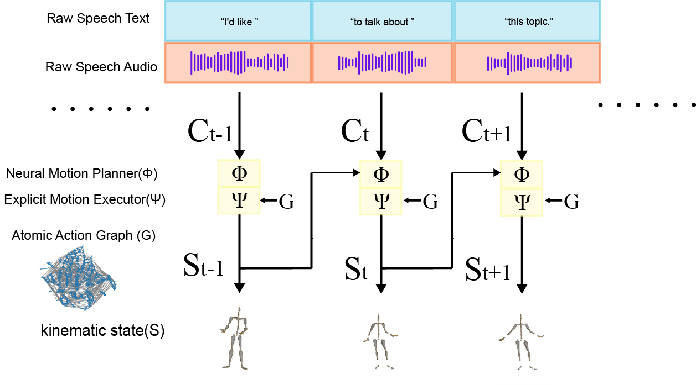
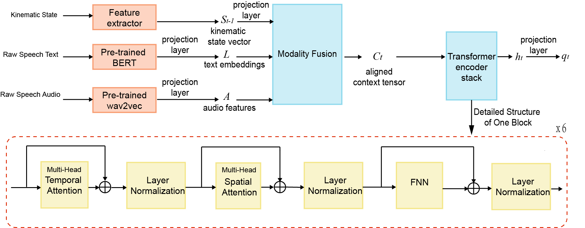

# NeRAG: Neuro-Explicit Retrieval-Augmented Generation for Real-Time Interaction in Digital Humans

## Demo

  <h2>🎬 Demo Video Available for Download</h2>
  
The demo video is available as a downloadable file:

  
  
Click the image to download the demo video

  <h2>Sample Images</h2>
  
  
<em>System Overview Diagram</em>

   
  
  
<em>RSMF Example</em>

  
  
<em>Multimodal Input</em>

## Features
- ✅ Supports multi-modal input of "voice + text"
- ✅ Supports real-time motion generation for virtual digital humans with a delay of less than 150ms
- ✅ Supports pre-trained models of `BERT` / `Wav2Vec`
- ✅ Supports standard `BVH` motion file input and output
- ✅ Supports real-time interaction with `Unreal Engine` through `LiveLink`
- ✅ Modular design, easy to expand custom networks and motion libraries

