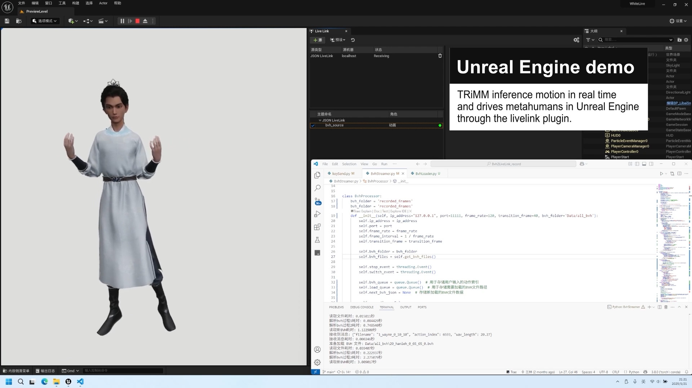
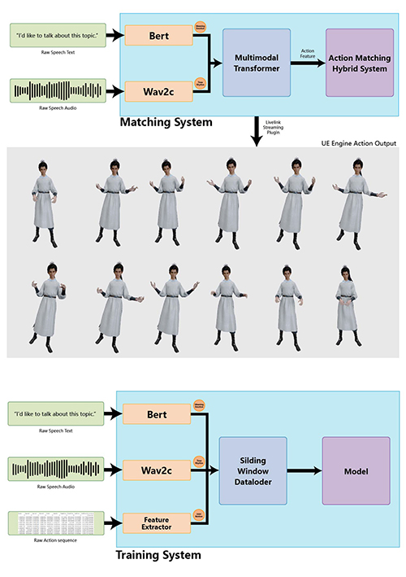

# Transformer Based Rich Motion Matching: Multi-modal Real-Time Motion Generation for Digital Humans

# Current under revising, may not run properly. we don't reconmend to download.

**TRiMM** is a multi-modal real-time digital human motion generation system based on the Transformer architecture. It supports voice and text input, and combines BERT, Wav2Vec, and motion matching networks to achieve natural motion expression of digital humans in virtual environments.

## Demo
<div align="center">
  <h2>🎥 Video demonstration</h2>
  <a href="https://www.youtube.com/watch?v=iXg1NN_boe8">
    
  </a>
  <p>Click the picture to see video demonstration</p>
</div>

## Features
- ✅ Supports multi-modal input of "voice + text"
- ✅ Supports real-time motion generation for virtual digital humans with a delay of less than 150ms
- ✅ Supports pre-trained models of `BERT` / `Wav2Vec`
- ✅ Supports standard `BVH` motion file input and output
- ✅ Supports real-time interaction with `Unreal Engine` through `LiveLink`
- ✅ Modular design, easy to expand custom networks and motion libraries


## Project Structure
```bash
TRiMM/
├──BvhLiveLink
│   ├── BvhProcessor.py
│   ├── BvhStreamer.py
│   ├── ConvertbvhToJson.py
│   ├── main.py
│   ├── output.json
│   ├── Parsebvh.py
│   ├── RealTimeIndex.txt
│   ├── RotationAalysis.py
│   └── SkeletonMapping.txt
│   └── bvh/                  # Directory for motion files
├── Data/                      # Directory for model and data files
│   ├── bert-base-chinese/
│   ├── wav2vec2-base-960h/
│   ├── bert-base-uncased/
│   ├── knn_graph.pkl
│   ├── motiongrapg.kpl
│   └── transformer_weight.pth              # Directory for motion files
├── examples/                   
├── inference.py              # Main inference script
├── MergeNp.py
├── ModelDefine.py
├── output.json
├── Processor.py
├── RealTimeIndex.py
├── Searcher.py
├── TrainModel.py
├── Wav2VecInferencePytorch.py
├── requirements.txt
└── README.md
```

## Requirements
CUDA >= 11.7

python = 3.8

numpy = 1.20

Pytorch = 2.4.0+cu117

## Installation
### Windows
First, we need to download the project to the local machine and open the project folder.
```bash
git clone https://github.com/author/TRiMM.git
cd TRiMM
```
Second, we need to create and configure a Python virtual environment.
Option: Conda
```bash
conda create -n TRiMM python=3.8
conda activate TRiMM
pip install -r requirements.txt
pip install torch==2.4.0+cu117 torchvision==0.15.1+cu117 torchaudio==2.4.0+cu117 --extra-index-url https://download.pytorch.org/whl/cu117
```

## Usage
### Preparation

#### bert-base-uncased
Place all the model files in the directory ".\TRiMM\Data\bert-base-uncased". The download address of the model is: https://huggingface.co/bert-base-uncased

#### wav2vec2-base-960h
Place all the model files in the directory ".\TRiMM\Data\wav2vec2-base-960h". The download address of the model is: https://huggingface.co/facebook/wav2vec2-base-960h

#### All BVH files of the motions
Place all the BVH files in the directory ".\TRiMM\BvhLiveLink\bvh"

### Training

### Testing
#### Step1: Run inference.py
```bash
python inference.py
```
#### Step2: Run bvhstreamer.py
```bash
python bvhstreamer.py
```
#### Step3: Run Unreal
Start the Unreal project

Enable the LiveLink plugin

Connect to the IP address where BVH Streamer is located in the LiveLink window

## Configuration

## License

## FAQ
Q1: Does it support Linux/macOS?
We have only tested on Windows so far. Theoretically, it can run normally on Linux, and we welcome contributors to test it.

Q2: Unreal cannot connect to LiveLink?
Please ensure that:

BVH Streamer is running

Unreal has enabled the LiveLink plugin

The network port is not blocked by the firewall

## Contributing
We welcome participation in development! You can contribute in the following ways:

Submit Pull Request

Report Bugs or propose Feature Request

Optimize documentation and code structure

